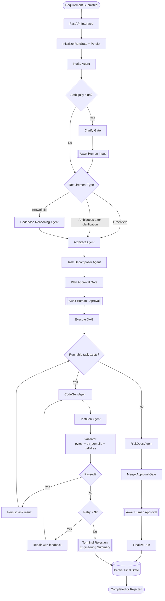

# Architecture Overview

This system is a stateful, agentic software engineering orchestrator. It transforms a natural-language requirement into a controlled, reviewable engineering outcome with explicit phase routing, human gates, validation loops, and persistent run state.

## End-to-End Flow



## Runtime Layers

## 1. Interface Layer

- FastAPI endpoints for submit, inspect, approve, and reject
- Live demo UI (`/live-demo`) for gate-driven demonstration flow
- Example scripts for greenfield, brownfield, and ambiguous scenarios

## 2. Orchestration Layer

- `orchestrator/graph.py` defines node flow and phase transitions
- `orchestrator/state.py` stores `RunState`, `TaskDAG`, validation history, and summaries
- Human gates pause execution at clarify, plan, and merge checkpoints

## 3. Agent Layer

- Intake: requirement normalization and ambiguity scoring
- Codebase reasoning: impacted-area analysis for brownfield
- Architect: components, API contract, data model, trade-offs
- Task decomposer: dependency-aware DAG
- Code/test generation and validation with bounded repair
- Risk docs: final engineering-grade summary generation

## 4. Tooling Layer

- Model provider abstraction: Anthropic, OpenAI, Ollama, scripted
- Sandbox runner for scoped test execution
- Repo index for AST/import-based brownfield impact analysis

## 5. Persistence and Artifacts

- SQLite-backed run persistence for pause/resume and crash recovery
- Per-run generated artifacts under `generated_projects/`
- Final summary markdown for evaluator-friendly traceability

## Assignment Requirement Mapping

1. Requirement understanding
- Intake node normalizes input into structured requirement data with ambiguity scoring.

2. Task decomposition
- Task decomposer emits dependency-aware DAG tasks with explicit execution order.

3. Brownfield codebase reasoning
- Brownfield route invokes repository indexing and impacted-area analysis before planning.

4. Workflow orchestration
- Graph routing coordinates clarify, planning, execution, risk docs, and merge gates.
- Cross-step coordination is state-driven (`RunState`) rather than isolated node calls.

5. Engineering output generation
- Architecture, code, tests, and summaries are generated through dedicated specialized agents.

6. Validation and risk control
- Validator enforces runtime/static checks; risk docs summarize trade-offs and failure modes.

7. Controlled autonomy
- Human approval interrupts are built into clarify, plan, and merge checkpoints.

8. Final structured output
- Final summaries include implementation rationale, artifacts, risks/trade-offs/validation, and limitations.

## OpenAI Integration Architecture

OpenAI is integrated via a chat completion client in `orchestrator/tools/model_provider.py`.

Primary behavior:

- structured output requested per Pydantic schema
- parse + validation retries when feasible
- schema-safe fallback synthesis if provider call fails
- domain-safe fallback coercion for critical objects (`RequirementSpec`, `TaskDAG`, etc.)

Latest resilience behavior:

- fallback reason text is humanized and sanitized
- raw upstream provider error strings are not shown in reviewer-facing output summaries

Example sanitized fallback text:

```text
Provider fallback used because the model provider request was blocked by quota/billing limits. Check provider credits and retry the run.
```

## Execution and Failure Semantics

Key guarantees in `execute_dag`:

- every task executes with explicit status tracking
- validation failure triggers bounded repair loop
- unrecoverable failure transitions run to terminal `rejected`
- rejection includes an engineering-grade final summary (not an opaque crash)

This prevents silent hangs and improves reviewer confidence in operational behavior.

## Why This Is Meaningful Orchestration (Not Linear Execution)

- Execution order is dependency-driven by DAG readiness, not static prompt chaining.
- Validation outcomes feed repair loops and alter subsequent execution behavior.
- Gate decisions (approve/reject/feedback) modify trajectory and can stop or resume runs.
- Brownfield and ambiguous requirements route into different phase paths before task execution.

## Crash Recovery and Resume

Recovery uses two mechanisms:

- `RunStateStore` persistence after phase transitions
- LangGraph checkpoint/interrupt behavior at gate boundaries

Operationally this means:

- runs can resume from last persisted phase
- human approval pauses are resumable
- process restarts do not require rerunning from intake

## Why This Architecture Is Assignment-Strong

- full lifecycle from requirement to engineering summary
- dependency-aware decomposition and bounded execution
- validation-driven acceptance criteria
- explicit human governance points
- resilience to provider outages and malformed model outputs
- reviewable, deterministic state transitions
