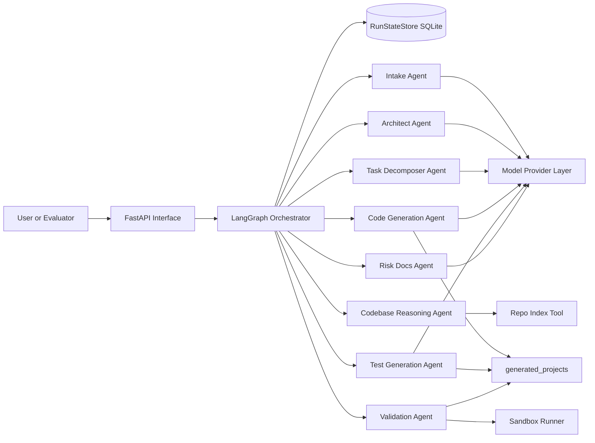
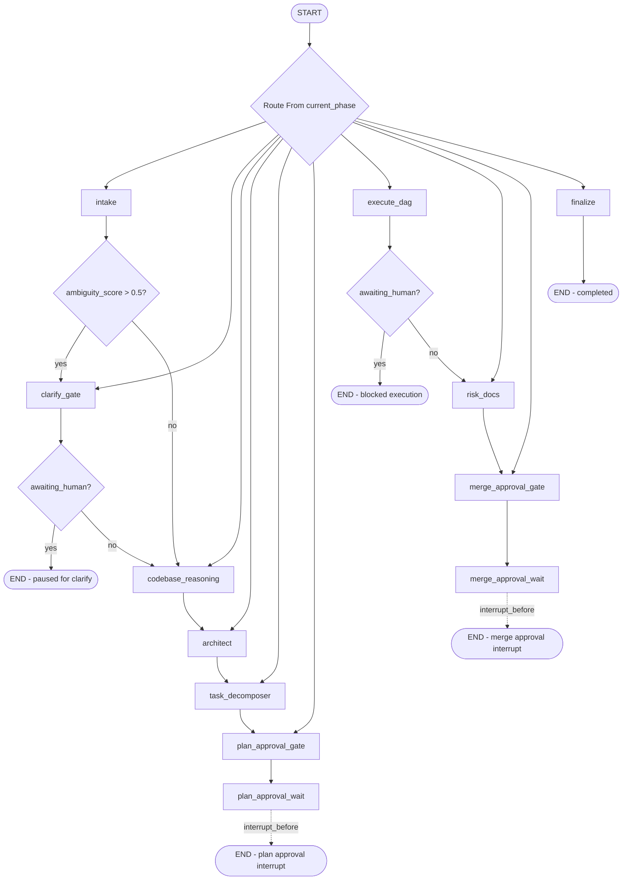

# Architecture Overview

This project is a stateful, agentic software engineering system that transforms a natural-language requirement into a reviewable engineering outcome through a controlled SDLC workflow.

The architecture is intentionally split into:

- orchestration control plane (state machine + gates + persistence)
- agent execution plane (analysis, planning, generation, validation)
- tool layer (model providers, sandbox execution, brownfield reasoning)
- interface layer (API endpoints + runnable scenario scripts)

For the mandatory requirement, the system supports:

- requirement analysis and ambiguity detection
- architecture and OpenAPI design generation
- dependency-aware task decomposition
- code, API, and test generation
- validation, retry/repair, and risk summary generation
- human oversight at plan and merge checkpoints

## High-Level System View

## Control-Flow Architecture

## Graph Flow

Key control-flow properties:

- state-driven routing using `current_phase`
- conditional clarify gate for ambiguous inputs
- explicit interrupt points before plan and merge waits
- retry-and-repair loop during DAG execution
- persistent state save after node transitions

## Runtime Layers

### 1. Interface Layer

- API interface for submit/get/approve/reject run control
- Scenario runners for greenfield, brownfield, and ambiguous demonstrations

### 2. Orchestration Layer

- `OrchestrationGraph` composes nodes, routes, and interrupt behavior
- Human approval gates provide controlled autonomy
- `RunState` acts as the single source of truth per run

### 3. Agent Layer

- semantic requirement understanding
- architecture and API design
- dependency-aware task planning
- implementation and test generation
- validation and repair
- risk and final-summary synthesis

### 4. Tool Layer

- model-provider abstraction (real-model or deterministic scripted path)
- repo impact analysis for brownfield scenarios
- sandboxed pytest execution and static checks

### 5. Artifact Layer

- generated implementation/test outputs under `generated_projects`
- final engineering summaries under `docs`
- persisted orchestration states in SQLite

## Agent Responsibilities

- IntakeAgent: parse requirement text into structured RequirementSpec with category, explicit/implicit requirements, ambiguities, and ambiguity score.
- CodebaseReasoningAgent: for brownfield requests, index the repo and identify impacted files/modules via AST extraction, import graph traversal, and keyword matching.
- ArchitectAgent: produce ArchitectureDesign (components, data model, OpenAPI YAML, trade-offs).
- TaskDecomposerAgent: produce TaskDAG with dependency-aware tasks and owned file boundaries.
- CodeGenAgent: generate implementation files per task, constrained to task-owned paths; supports repair loop using validation feedback.
- TestGenAgent: generate pytest tests per task (unit + integration-level behavior).
- ValidationAgent: run pytest plus static checks (`py_compile`, `pyflakes`) and return structured ValidationResult.
- RiskDocsAgent: synthesize risks and final engineering summary markdown with required review sections.

## Mandatory Use Case Coverage (URL Shortener)

Requirement:

"Build a scalable URL shortener service with APIs, persistence, and analytics."

How this architecture covers it:

1. Intake agent structures the requirement and ambiguities.
2. Architect agent produces components, data model, OpenAPI, and trade-offs.
3. Task decomposer creates dependency-aware implementation/test tasks.
4. Code and test generators produce URL shortener artifacts.
5. Validator runs `pytest`, `py_compile`, and `pyflakes`.
6. Risk docs summarize trade-offs and validation strategy.
7. Plan and merge approval gates enforce controlled human oversight.

## Data and State Model

Core state entities:

- `RequirementSpec`: normalized requirement interpretation
- `ArchitectureDesign`: components, data model, API contract, trade-offs
- `TaskDAG` and `Task`: execution graph with dependencies and owned files
- `ValidationResult`: validation outcomes and issue tracking
- `RunState`: lifecycle state for the full run

State transitions are deterministic and persisted, enabling reliable pause/resume and post-run auditability.

## Crash Recovery Mechanism

Recovery is implemented in two layers:

- RunStateStore (SQLite): each node persists the full RunState after transition. If the process crashes, the latest persisted state can be loaded by run_id.
- LangGraph checkpointing: graph execution uses a checkpointer and interrupt points (`interrupt_before`) for human gates. On resume, the graph continues from the appropriate phase/thread rather than starting over.

Combined behavior:

- During normal execution, every node update is saved.
- At human approval gates, execution pauses at interrupt points with `awaiting_human=True` and a `review_payload`.
- On approval/resume, the orchestration reloads RunState and continues from current_phase.

## Deployment and Execution Options

Supported run paths:

- Local Python execution (`uvicorn`, scripts, pytest)
- Docker/Compose API execution for evaluator-friendly reproducibility

Model-provider flexibility:

- Anthropic for real-model runs
- Ollama for local-model runs
- Scripted provider for deterministic mandatory-use-case demonstration

## Architecture Strengths

- clear separation of control-plane and execution-plane responsibilities
- explicit dependency-aware orchestration rather than single-prompt generation
- built-in validation and bounded repair loop for output quality
- controlled autonomy through human approval gates
- persistence and checkpointing for resilience and traceability
